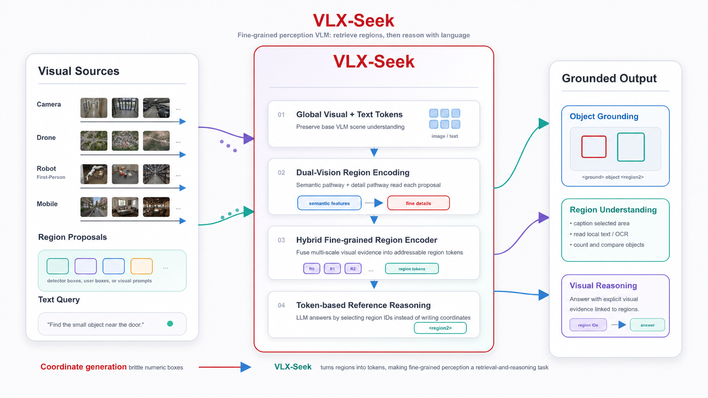
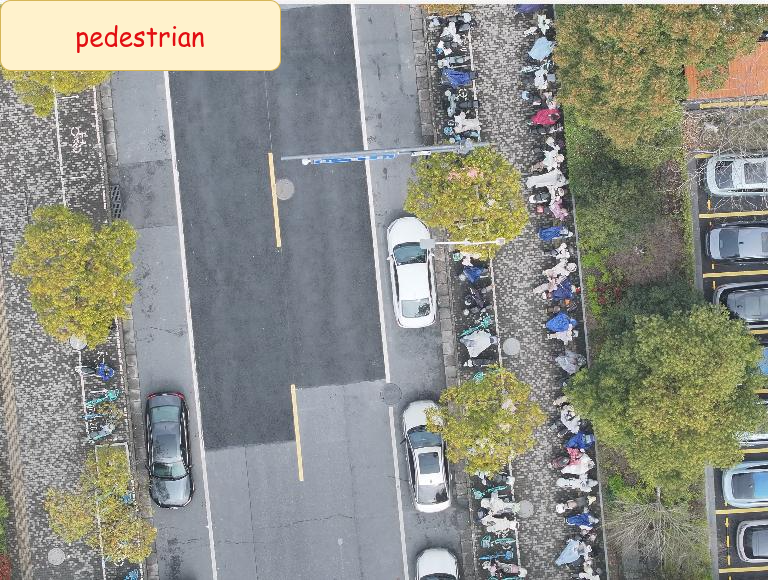
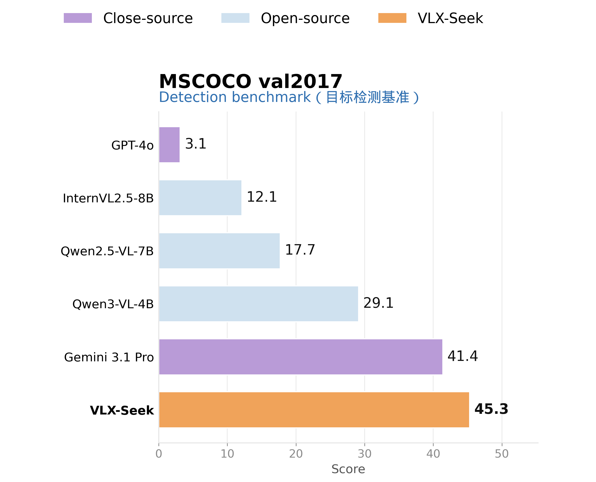
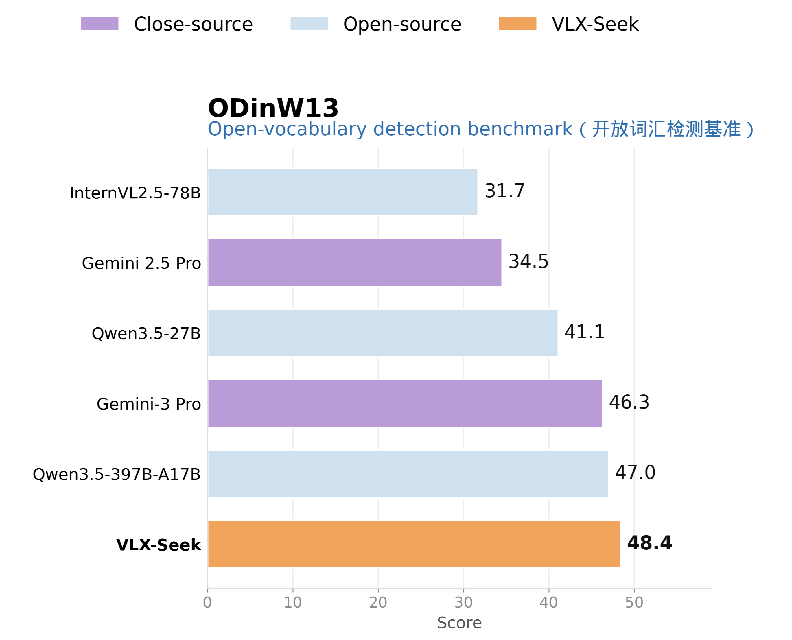
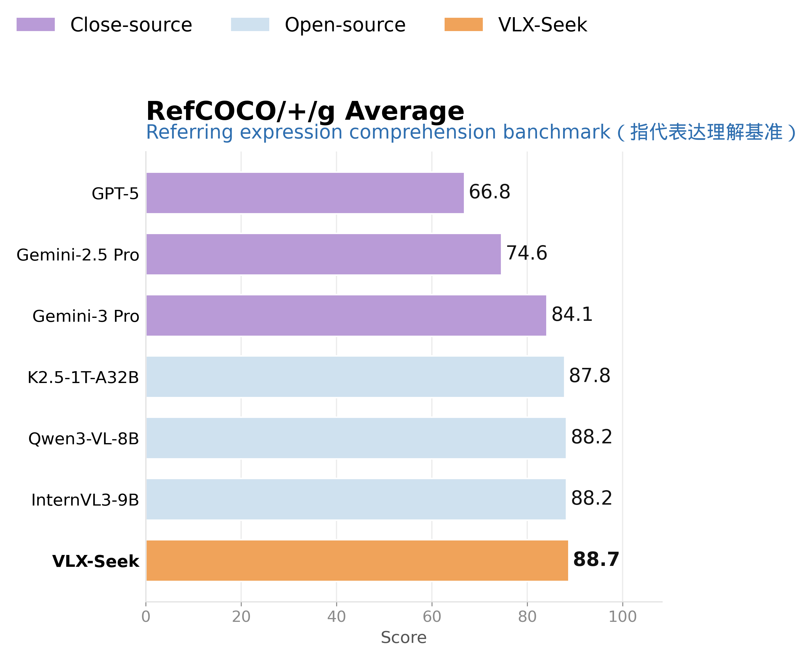
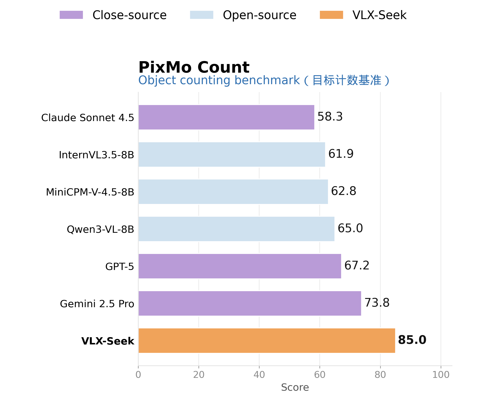

<p align="center">
  
</p>

<h1 align="center">VLX-Seek</h1>

<h3 align="center">Fine-Grained Perception VLM: From Coordinate Generation to Region Reference</h3>

<p align="center">
  English | <a href="README_zh.md">中文</a>
</p>

<p align="center">
  <a href="https://x.com/OmAI_lab">
    
  </a>
  <a href="https://www.youtube.com/@OmAILab_global">
    
  </a>
  <a href="https://discord.gg/c3BNhbcyd">
    
  </a>
  <br>
  <a href="https://om-ai-lab.github.io/2026_07_06_vlx_seek_1_5_en.html">
    
  </a>
  <a href="https://huggingface.co/blog/omlab/vlx-seek">
    
  </a>
  <a href="https://huggingface.co/omlab/VLX-Seek-1.5-10B">
    
  </a>
  <a href="https://om-agent.cn/#/front">
    
  </a>
</p>

<p align="center"><sub>Overview video: VLX-Seek for edge multimodal fine-grained perception</sub></p>

https://www.youtube.com/watch?v=VoTLjBgCAKk

VLX-Seek is a fine-grained perception vision-language model for edge-side embodied vision. It is designed for scenarios where a model must not only understand what is in an image, but also identify where the relevant objects are, which instance is being referred to, and when a target does not exist.

Instead of asking the language model to directly generate bounding-box coordinates, VLX-Seek reformulates localization as region retrieval and region reference. Candidate regions are encoded as addressable region tokens, and the language model answers by selecting, comparing, and referring to those regions.

> [!TIP]
>
> **🚀 Try [VLX-Seek](https://om-agent.cn/)** and explore how it understands, locates, and reasons about the visual world.

## Community

Join the VLX community to connect with developers, explore applications, share feedback, and shape the future of multimodal AI.

<table align="center">
  <thead>
    <tr>
      <th><div align="center">Official WeChat</div></th>
      <th><div align="center">Discord Community</div></th>
    </tr>
  </thead>
  <tbody>
    <tr>
      <td align="center">
        
      </td>
      <td align="center">
        <a href="https://discord.gg/c3BNhbcyd">
          
        </a>
      </td>
    </tr>
  </tbody>
</table>

For technical support, partnerships, and community inquiries, contact us at **[marketing@hzlh.com](mailto:marketing@hzlh.com)**.

## Updates

- **[2026-07-23]** 🔥🔥🔥 The inference code and model weights for **VLX-Seek 1.5-10B** are now open source. Checkpoint: [omlab/VLX-Seek-1.5-10B](https://huggingface.co/omlab/VLX-Seek-1.5-10B).
- **[2026-07-06]** [VLX-Seek 1.5](https://om-ai-lab.github.io/2026_07_06_vlx_seek_1_5_en.html) is released, bringing stronger fine-grained perception, faster inference, and improved rejection of absent targets for embodied scenarios.


## Overview
<p align="center">
  
</p>
Modern VLMs are strong at global scene understanding. They can describe images, answer visual questions, follow complex instructions, and perform multimodal reasoning. However, fine-grained perception requires a different level of visual grounding:

- **Precise localization:** where the target is and how its boundary should be separated from nearby objects.
- **Instance distinction:** which object instance matches a language description.
- **Multi-object reasoning:** how many targets exist and which regions should be returned.
- **Open-vocabulary rejection:** when no region matches the query, the model should say so instead of hallucinating a box.

Many VLMs handle localization by generating coordinates such as `[x1, y1, x2, y2]`. This format is brittle for language models. Coordinates are long numeric sequences, multiple objects multiply the output length, and small formatting or ordering errors can make the result invalid or inaccurate. Meanwhile, traditional coordinate generation requires more output tokens, lengthens the decoding path, and lowers inference efficiency.

VLX-Seek changes the task from:

```text
image + text query -> generate coordinate numbers -> parse boxes
```

to:

```text
image + region tokens + text query -> retrieve matching regions -> grounded answer
```

This makes localization closer to what LLMs already do well: compare, select, refer, explain, and reason over explicit entities.

## Open-Source Models

VLX-Seek 1.5 is planned as a family of 0.6B, 3B, and 10B models. This repository releases the inference code and model weights for the **10B** model.

| Model | Checkpoint | Status |
| --- | --- | --- |
| VLX-Seek 1.5-10B | [omlab/VLX-Seek-1.5-10B](https://huggingface.co/omlab/VLX-Seek-1.5-10B) | Released |


### What's New in VLX-Seek 1.5

- **Stronger embodied perception:** expanded drone-view, surveillance-view, robot-view, and other embodied-scene training data.
- **Upgraded visual stack:** a stronger auxiliary vision tower and VLM backbone improve fine-grained region understanding and complex target detection.
- **Faster inference:** a faster proposal pipeline and more Linear Attention layers reduce inference and memory cost.
- **Fewer hallucinated detections:** hard-negative rejection training and an explicit `None` format help the model reject requested targets that are absent.

See the [VLX-Seek 1.5 blog](https://om-ai-lab.github.io/2026_07_06_vlx_seek_1_5_en.html) for architecture details, benchmark results, and qualitative examples.

## Requirements

- Python 3.10+
- PyTorch (GPU recommended). Please install the CUDA-enabled build that matches your system.
- Linux is the primary tested platform.

## Installation

```bash
git clone https://github.com/om-ai-lab/VLX-Seek.git
cd VLX-Seek
pip install -r requirements.txt
```


## Model Weights

The VLX-Seek 1.5-10B checkpoint is hosted on Hugging Face: [omlab/VLX-Seek-1.5-10B](https://huggingface.co/omlab/VLX-Seek-1.5-10B).

### Load from Hugging Face

The VLX-Seek main model can be loaded directly without a manual download:

```bash
python inference.py \
  --model-path omlab/VLX-Seek-1.5-10B \
  --image-path demo/demo_image.jpg \
  --task detection \
  --text "orange; apple"
```

The first run will download and cache the VLX-Seek weights from Hugging Face. Make sure you have cloned this repository and installed the dependencies first, since the model architecture is provided by the local `vlx_seek` package.

For detection, grounding, and other proposal-dependent tasks, if `--bbox-list` is not provided, the recommend region detector checkpoint is automatically downloaded from Hugging Face to the default path `resources/` when needed. You can also override the path with `--detector-checkpoint`, or pass `--bbox-list` to skip the detector entirely.

In Python, you can also load the model with:

```python
from vlx_seek_worker import VLXSeekWorker

worker = VLXSeekWorker("omlab/VLX-Seek-1.5-10B", device="cuda")
```

### Download Locally

Alternatively, download the checkpoint and the region detector checkpoint into the following layout:

```text
resources/
├── VLX-Seek-1.5-10B/
└── wedetect_base_uni.pth
```

Download links:

- VLX-Seek 1.5-10B: [omlab/VLX-Seek-1.5-10B](https://huggingface.co/omlab/VLX-Seek-1.5-10B)
- Region detector checkpoint: [WeDetect](https://huggingface.co/fushh7/WeDetect)

Both paths can be overridden with `--model-path` and `--detector-checkpoint`.

### Region Proposal Model

> **Note:** Due to company policy, we are unable to release the internally trained OPN referenced in our blog. Instead, this repository integrates the open-source, lightweight **WeDetect-Base-Uni** detector as an alternative for generating proposal bounding boxes.

You may also use any object detector of your choice. Convert its proposals to pixel-coordinate boxes in `[x1, y1, x2, y2]` format and pass them with `--bbox-list`. The built-in region detector is only loaded when `--bbox-list` is omitted.

## Quick Start

Run open-vocabulary detection with automatically generated proposals:

```bash
python inference.py \
  --image-path demo/demo_image.jpg \
  --task detection \
  --text "orange; apple"
```

Run general visual question answering without region proposals:

```bash
python inference.py \
  --image-path demo/demo_image.jpg \
  --task vqa \
  --text "What fruits are in the image?"
```

Detection results are printed as JSON and visualized to `<image_stem>_result.png` by default. See the **[complete inference guide](docs/inference.md)** for all tasks, custom proposals, generation options, output fields, and the Python API.

## VLX-Seek 1.5 Representative Examples

The following examples demonstrate VLX-Seek 1.5's fine-grained perception and object localization across different device viewpoints. (<font color="#7c3aed"><strong><em>Click an image to view the full-resolution result and detection details</em></strong></font>)

<table align="center" width="100%" cellpadding="0" cellspacing="0" style="border-collapse:collapse">
  <tbody>
    <tr>
      <td width="43%" align="center" style="padding:0 2px">
        <a href="assets/seek1.5-seek1.5-water bottles that are not on the cardboard box.png"></a>
      </td>
      <td width="57%" align="center" style="padding:0 2px">
        <a href="assets/seek1.5-seek1.5-person riding electric bike.png"></a>
      </td>
    </tr>
    <tr>
      <td width="43%" align="center" style="padding:0 2px">
        <a href="assets/seek1.5-seek1.5-pedestrian.png"></a>
      </td>
      <td width="57%" align="center" style="padding:0 2px">
        <a href="assets/seek1.5-seek1.5-car on the road.png"></a>
      </td>
    </tr>
  </tbody>
</table>

## Problem Setting

Embodied and edge-side visual systems need stable spatial anchors. Monitoring cameras, drones, robots, robot dogs, mobile devices, and inspection systems often need to know not only "what is visible", but also:

- where the object is
- which instance the instruction refers to
- whether the target is still present
- whether the requested object is absent
- whether the target can be found quickly and efficiently

For these devices, fine-grained grounding is not just an offline benchmark. A monitoring camera may need to locate a person entering a restricted area, a drone may need to find a small target from an aerial view, a robot may need to grasp or avoid a specific object, and a robot dog may need to follow, inspect, or navigate around a referenced target under limited compute and power budgets.

VLX-Seek focuses on a core question:

> How can VLMs acquire fine-grained localization capabilities, improve reasoning efficiency, and avoid requiring language models to generate fragile coordinate strings?

VLX-Seek’s answer is:

> Turn visual regions into entities that the language model can address and refer to.

## Region Reference

VLX-Seek models candidate visual regions as addressable region tokens. Conceptually, these can be understood as region indices such as `<region0>`, `<region1>`, and `<region2>`; in the model's actual special-token format, they are serialized as `<obj0>`, `<obj1>`, and `<obj2>`. Both forms refer to the same idea: each token corresponds to a candidate visual region in the image.

When a user asks "Find the people wearing red", the model does not need to write four numeric coordinates from scratch. It can inspect the candidate region tokens, identify the regions that best match the description, and output the corresponding `<obj*>` region references.

For example:

```text
<ground>people wearing red</ground><objects><obj2><obj5></objects>.
```

Here, `<obj2><obj5>` is the model's concrete special-token output for the selected candidate regions. After generation, the system can use these region indices to quickly look up the corresponding input proposals and map them back to actual bbox coordinates. This output is compact, easier to parse, and better aligned with language-model behavior than long coordinate sequences. It is also faster to decode: for multiple targets, VLX-Seek only needs to emit short region IDs instead of full `[x1, y1, x2, y2]` coordinate tuples for every object. The same mechanism can support open-vocabulary detection, referring expression comprehension, region captioning, region VQA, OCR, counting, and visual reasoning.

## Inference Pipeline

VLX-Seek uses a decoupled region-first pipeline.

### 1. Region Proposal

The system first recalls candidate foreground regions with a candidate region generation network. This stage is responsible for proposing possible object regions, not for making the final semantic decision.

The proposal module is decoupled from the VLM backbone. In practical deployments, it can be flexibly replaced by another detector, user-provided boxes, or visual prompts.

### 2. Hybrid Fine-Grained Region Encoder

Candidate boxes are geometric hints; by themselves they do not tell the language model what is inside each region. VLX-Seek therefore uses a Hybrid Fine-Grained Region Encoder (HFRE) to convert each candidate region into a region-level visual representation.

HFRE combines two complementary visual pathways:

- **Semantic pathway:** preserves the base VLM's visual-language alignment and high-level image understanding.
- **Detail pathway:** provides higher-resolution local details, spatial structure, boundaries, textures, and small-object cues.

SimpleFP adds multi-scale visual features for ViT-style representations, helping the model handle both large objects and small local targets. Region features are then projected into the LLM embedding space through a region-language connector, so each candidate box becomes a readable and referable region token.

### 3. Token-Based Reasoning

After region encoding, the model receives global image tokens, text tokens, and numbered region tokens. The LLM can then perform language-conditioned retrieval over the candidate regions and produce grounded output by referencing region IDs.

This makes the inference path clear:

1. Recall candidate regions.
2. Encode each region as a token.
3. Match language queries to region tokens.
4. Output region references and natural-language reasoning.

Because the final grounded answer is expressed as region references, the language model spends fewer output tokens on localization. This matters on edge-side embodied systems, where faster decoding can reduce response latency for interactive perception, navigation, inspection, and human-robot interaction.

## Supported Capabilities

VLX-Seek supports a broad set of region-centric perception tasks:

- **Open-vocabulary detection:** find targets described by flexible text labels.
- **Referring expression comprehension:** identify the instance that matches a complex description.
- **Region OCR:** read text from selected visual regions.
- **Region captioning:** describe selected areas in detail.
- **Object counting:** count instances by detecting and aggregating regions.
- **Visual region reasoning:** use explicit regions as evidence for multi-step answers.
- **General VQA:** answer free-form questions about the full image without requiring proposals.

## Training Strategy

VLX-Seek uses a two-stage training strategy to add fine-grained perception while preserving the VLM's general capability.

### 1. Region-Language Alignment

The first stage teaches the model how region tokens correspond to visual regions. The main VLM backbone is largely frozen, while HFRE, the region-language connector, and newly added special tokens are trained to align region features with the LLM embedding space.

This stage establishes the basic ability to read a region token as a visual entity.

### 2. Perception Instruction Tuning

The second stage introduces richer perception instructions, including detection, referring expression comprehension, region captioning, region reasoning, counting, and OCR.

Two risks are handled during this stage:

- **Catastrophic forgetting:** general VLM instruction data is mixed in to preserve broad image understanding, VQA, captioning, and reasoning ability.
- **Hallucinated localization:** negative and rejection samples teach the model to answer that no matching target exists instead of forcing a region output.

The goal is not only to teach the model how to find objects, but also when not to find them.

## Results Comparison

The following figures report results for the original VLX-Seek 3B model. For VLX-Seek 1.5-3B and 1.5-10B results across general recognition, drone scenarios, embodied spatial reasoning, and object hallucination, see the [VLX-Seek 1.5 blog](https://om-ai-lab.github.io/2026_07_06_vlx_seek_1_5_en.html).

<table align="center">
  <tr>
    <td width="50%" align="center">
      
    </td>
    <td width="50%" align="center">
      
    </td>
  </tr>
  <tr>
    <td width="50%" align="center">
      
    </td>
    <td width="50%" align="center">
      
    </td>
  </tr>
</table>

## Why VLX-Seek

- Compared with a general VLM, VLX-Seek explicitly models candidate visual regions and can ground answers to object instances.

- Compared with a traditional detector, VLX-Seek can use natural language, open-vocabulary semantics, and visual reasoning rather than only predicting closed-set categories.

- Compared with coordinate-generation VLMs, VLX-Seek avoids long numeric box outputs and uses shorter, more stable region references, which can reduce decoding cost and improve response speed in multi-object scenarios.

- Compared with simply attaching a detector head, VLX-Seek makes regions internal visual-language entities that can participate in reasoning, comparison, dialogue, and explanation.

## Technology Lineage

Our team has spent years building in visual perception, with open-source projects such as [OmDet-Turbo](https://github.com/om-ai-lab/OmDet), [VLM-R1](https://github.com/om-ai-lab/VLM-R1), and [VLM-FO1](https://github.com/om-ai-lab/VLM-FO1) receiving strong attention and recognition from the community. VLX-Seek brings together and extends these accumulated strengths in open-vocabulary detection, region-level understanding, and fine-grained perception as one of the latest works in the VLX series, which will continue to evolve through future updates.
